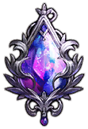
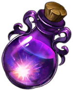
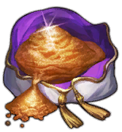
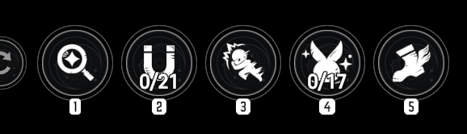

# **GAME GUIDE CƠ BẢN VÀ NHỚ ĐỌC LƯU Ý TRƯỚC FUCK YOU**

**From**: Lốc Xoáy Tinh Hoàn

**Source**: 

- Trust me bruh trong ae discord
- <https://browndust2.miraheze.org/wiki/Character>

------

Guide bố mày viết theo kinh nghiệm cá nhân và suy nghĩ cá nhân nên có thể đúng với người này sai với người khác vì vậy nào lèm bèm vô discord ping **@Anash** solo.

## Mục Lục

- [**GAME GUIDE CƠ BẢN VÀ NHỚ ĐỌC LƯU Ý TRƯỚC FUCK YOU**](#game-guide-cơ-bản-và-nhớ-đọc-lưu-ý-trước-fuck-you)
  - [Mục Lục](#mục-lục)
  - [Mục tiêu của Guide](#mục-tiêu-của-guide)
  - [🚨 Lưu ý quan trọng](#-lưu-ý-quan-trọng)
  - [Ability skill](#ability-skill)
  - [Xây dựng đội hình](#xây-dựng-đội-hình)
    - [Team vật lí](#team-vật-lí)
    - [Ví dụ combo support vật lí](#ví-dụ-combo-support-vật-lí)
  - [Tier List cá nhân](#tier-list-cá-nhân)
  - [Awakening](#awakening)
  - [Refine Gear](#refine-gear)
  - [Weapons](#weapons)
  - [Bonding](#bonding)
  - [Event shop](#event-shop)
  - [Golden Thread Shop](#golden-thread-shop)
  - [Guild Shop](#guild-shop)
  - [Powder of Hope Shop](#powder-of-hope-shop)
  - [The Golden Colosseum Shop](#the-golden-colosseum-shop)
  - [Refinement Remnant Shop](#refinement-remnant-shop)
  - [Mirror Wars Shop](#mirror-wars-shop)
  - [Potential of Tear](#potential-of-tear)
    - [Team vật lí](#team-vật-lí-1)
    - [Team phép](#team-phép)
    - [Team vật lí + phép](#team-vật-lí--phép)
  - [Spark of rampage](#spark-of-rampage)

## Mục tiêu của Guide

- Một vài từ lóng anh em hay xài
- Hỗ trợ acc reroll
- Xây dựng [**Đội Hình**](#xây-dựng-đội-hình) cơ bản
- Hướng dẫn chạy map hiệu quả bằng [**Ability skill**](#ability-skill)
- Quản lí và khai thác tài nguyên
- Một số nhân vật xương sống cho vài đội hình
- [**Tier list**](#tier-list-cá-nhân) theo ý kiến Khá Bảnh

## 🚨 Lưu ý quan trọng

- Không sử dụng  [**Tear**](#potential-of-tear) or [**pot**](#potential-of-tear) 1 cách bừa bãi vì nó là tài nguyên có hạn
- Không sử dụng  [**Burst**](#spark-of-rampage) or [**bút**](#spark-of-rampage) 1 cách bừa bãi vì nó là tài nguyên có hạn
- Không  [**Awakening**](#awakening) linh tinh
- Không sử dụng  [**Refining Crystal**](#refine-gear) cho [**Weapons**](#weapons) tier thấp
- Hạn chế sử dụng  [**Refining Powder**](#refine-gear) cho [**Weapons**](#weapons) ở đầu game, vũ khí 18 điểm là sử dụng khá ok rồi

## Ability skill

**Set Up chạy map**

1. **Search**: Dùng để phát hiện tài nguyên ẩn trong map
2. **Absorption**: Dùng để hút toàn bộ tài nguyên trên map
3. **OverPower**: Dùng để tông quái trên map đỡ tốn thời gian đánh
4. **Assemble**: Dùng hút mấy con thỏ xanh trên map kiếm tí vàng
5. **Rush**: Dùng để tăng tốc chạy, nên sử dụng Luven vì nó chạy nhanh nhất

**Lộ trình chạy:** từ map 1 => map cao nhất

**Thứ tự dùng skill:**

**Search** -> **Absorption** -> **OverPower** -> **Assemble** -> **Rush**

Theo nguồn Trust me bro chạy full thì 1 tuần cày được 5-6m vàng.

## Xây dựng đội hình

### Team vật lí

**Các buffer cơ bản**

| Diana 1 | Liberta | Lathel |
| :---: | :---: | :---: |
|  |  |  |
| Buff thêm dmg khi mục tiêu khắc hệ Một tí Crit Rate | Buff %ATK Hồi SP Crit Rate | Buff %ATK |

| Arines | Rou | Terresa |
| :---: | :---: | :---: |
|  |  |  |
| Buff %ATK Crit Rate | Buff giáp Crit Rate %CRD | Buff % DMG Deal Điều kiện: đánh <= 5 mục tiêu Mục tiêu <= 5 chain |

Một đội hình cơ bản bao gồm từ **2-3 support**, còn lại là các **DPS** sở hữu **range skill** to.

Đặc biệt **Diana 1** chỉ sử dụng khi có **mục tiêu bị DPS khắc hệ**.

### Ví dụ combo support vật lí

**Combo 1**

| Liberta | Lathel | Rou |
| :---: | :---: | :---: |
|  |  |  |
| Buff %ATK Hồi SP Crit Rate | Buff %ATK | Buff giáp Crit Rate %CRD |

**Combo 2**

| Liberta | Arines | Lathel |
| :---: | :---: | :---: |
|  |  |  |
| Buff %ATK Hồi SP Crit Rate | Buff %ATK Crit Rate | Buff %ATK |

**Combo 3**

| Liberta | Rou | Terresa |
| :---: | :---: | :---: |
|  |  |  |
| Buff %ATK Hồi SP Crit Rate | Buff giáp Crit Rate %CRD | Buff % DMG Deal Điều kiện: đánh <= 5 mục tiêu Mục tiêu <= 5 chain |

## Tier List cá nhân

> Phần này có thể thêm sau theo format:
>
> | Nhân vật | Vai trò | Độ ưu tiên | Ghi chú |
> | :---: | :---: | :---: | :--- |
> | Tên nhân vật | DPS / Support / Tank | Cao / Trung bình / Thấp | Lý do nên dùng |

## Awakening

> **Awakening** giúp tăng sức mạnh nhân vật/costume nhưng tài nguyên có hạn.
>
> Ưu tiên Awakening cho:
>
> - DPS chính sử dụng lâu dài
> - Support core dùng nhiều content
> - Nhân vật dùng cho boss/event/guild raid
>
> Không nên Awakening linh tinh ở đầu game.

## Refine Gear

> **Refine Gear** dùng để tối ưu chỉ số trang bị.
>
> Lưu ý:
>
> - Đầu game không cần refine quá sâu
> - Không nên dùng tài nguyên refine hiếm cho vũ khí tier thấp
> - Vũ khí khoảng 18 điểm là đủ dùng ổn ở giai đoạn đầu
> - Chỉ refine mạnh khi đã có gear tốt và nhân vật dùng lâu dài

## Weapons

> Ưu tiên weapon cho DPS chính trước.
>
> Gợi ý:
>
> - DPS vật lí: ưu tiên ATK / Crit Damage / Crit Rate tùy build
> - DPS phép: ưu tiên MATK / Crit Damage / Crit Rate tùy build
> - Support: ưu tiên chỉ số giúp sống sót hoặc đáp ứng yêu cầu rotation
>
> Không nên đầu tư quá sâu vào weapon tier thấp.

## Bonding

> **Bonding** giúp tăng thêm chỉ số hoặc mở thêm lợi ích cho nhân vật.
>
> Ưu tiên bonding cho:
>
> - DPS chính
> - Support core
> - Nhân vật dùng nhiều trong boss/event/guild raid
>
> Không nên dàn trải quá nhiều nếu tài nguyên còn ít.

## Event shop

> Event shop nên ưu tiên mua tài nguyên giới hạn trước.
>
> Gợi ý ưu tiên:
>
> 1. Tear / Pot nếu có
> 2. Burst / Spark nếu có
> 3. Vé roll / tài nguyên nâng cấp quan trọng
> 4. Gold / nguyên liệu phụ
>
> Tùy event mà thứ tự có thể thay đổi.

## Golden Thread Shop

> Golden Thread Shop thường dùng để đổi các tài nguyên quan trọng.
>
> Ưu tiên:
>
> - Tài nguyên hiếm
> - Costume/dupe quan trọng nếu có
> - Các vật phẩm giúp nâng cấp lâu dài
>
> Không nên tiêu bừa nếu chưa biết acc đang cần gì.

## Guild Shop

> Guild Shop nên mua các vật phẩm giới hạn theo tháng.
>
> Ưu tiên:
>
> - Tear / Pot
> - Burst / Spark
> - Tài nguyên nâng cấp quan trọng
>
> Nên tham gia guild sớm để tích tài nguyên đều.

## Powder of Hope Shop

> Powder of Hope Shop dùng để đổi costume hoặc tài nguyên quan trọng.
>
> Lưu ý:
>
> - Không đổi bừa costume chỉ vì thích
> - Ưu tiên costume support hoặc DPS mạnh dùng lâu dài
> - Nên hỏi thêm nếu không chắc costume đó có đáng đổi không

## The Golden Colosseum Shop

> Shop này nên ưu tiên tài nguyên giới hạn theo tháng.
>
> Gợi ý:
>
> - Tear / Pot
> - Burst / Spark
> - Tài nguyên nâng cấp quan trọng
>
> Tùy acc mà có thể thay đổi ưu tiên.

## Refinement Remnant Shop

> Shop này liên quan đến tài nguyên refine.
>
> Ưu tiên mua tài nguyên giúp tối ưu gear, nhưng không nên dùng quá sớm nếu acc chưa có gear tốt.

## Mirror Wars Shop

> Mirror Wars Shop nên mua các tài nguyên giới hạn.
>
> Gợi ý:
>
> - Tear / Pot
> - Burst / Spark
> - Tài nguyên nâng cấp quan trọng
>
> Cố gắng chơi đều để tích shop theo thời gian.

## Potential of Tear

Và còn rất nhiều Costume khác phải POT để đánh Boss Event, Boss Guild Raid. Nên tùy mục đích chơi có thể sẽ sử dụng POT và team đánh Boss. Dưới đây chỉ là những cos cơ bản dùng nhiều.

Sử dụng ưu tiên cho các **Supports** buff trước. Đề xuất theo 2 hướng cơ bản:

### Team vật lí

| Liberta | Lathel |
| :---: | :---: |
|  |  |
| **Tác dụng khi POT:** Tăng hiệu quả support / cải thiện buff cho team vật lí. **Ưu tiên:** Cao nếu chơi physical team. **Ghi chú:** Core support nên cân nhắc đầu tư sớm. | **Tác dụng khi POT:** Tăng sức mạnh buff ATK / hỗ trợ burst damage. **Ưu tiên:** Cao nếu dùng nhiều DPS vật lí. **Ghi chú:** Một trong các lựa chọn POT quan trọng cho team vật lí. |

### Team phép

| Helena | Granadair |
| :---: | :---: |
|  |  |
| **Tác dụng khi POT:** Hỗ trợ team phép / tăng damage phép hoặc khả năng vận hành team. **Ưu tiên:** Cao nếu chơi magic team. **Ghi chú:** Support phép quan trọng, check đúng costume trước khi POT. | **Tác dụng khi POT:** Hỗ trợ team phép / tăng hiệu quả buff hoặc damage setup. **Ưu tiên:** Tùy đội hình phép đang chơi. **Ghi chú:** Nên POT nếu dùng thường xuyên trong boss/content phép. |

### Team vật lí + phép

| Diana 1 | Diana 2 | Terresa |
| :---: | :---: | :---: |
|  |  |  |
| **Tác dụng khi POT:** Tăng hiệu quả buff elemental advantage damage. **Ưu tiên:** Cao nếu thường đánh boss có lợi thế hệ. **Ghi chú:** Dùng tốt cho cả team vật lí và phép khi có khắc hệ. | **Tác dụng khi POT:** Hỗ trợ thêm cho Diana tùy costume / tăng tính linh hoạt. **Ưu tiên:** Tùy account và content. **Ghi chú:** Check đúng costume trước khi dùng Tear. | **Tác dụng khi POT:** Tăng hiệu quả support / buff damage linh hoạt. **Ưu tiên:** Trung bình đến cao tùy team. **Ghi chú:** Dùng được trong nhiều đội hình, nhưng vẫn nên ưu tiên core support trước. |

## Spark of rampage

Dùng để nâng sức mạnh skill của nhân vật hơn nữa, cụ thể check từng cos.

Nguồn: Wiki BD2

| Tên Cửa hàng (Shop) | Số lượng | Thời gian reset |
| :--- | :---: | :--: | 
| **Event shop** | 30x2 | 1 tháng |
| Golden Thread Shop | 55 | 1 tháng | 
| Guild Shop | 50 | 1 tháng |
| Powder of Hope Shop | 55 | 1 tháng |
| The Golden Colosseum Shop | 55 | 1 tháng |
| Refinement Remnant Shop | 200 | 1 tháng |
| Mirror Wars Shop | 55 | 1 tháng |
| Taros Tactical Manual | 30 | 1 tháng |

> **Ghi chú:** Spark/Burst là tài nguyên có hạn, không nên dùng chỉ vì thích nhân vật. Nên ưu tiên costume dùng lâu dài hoặc costume giúp clear boss/event/guild raid.