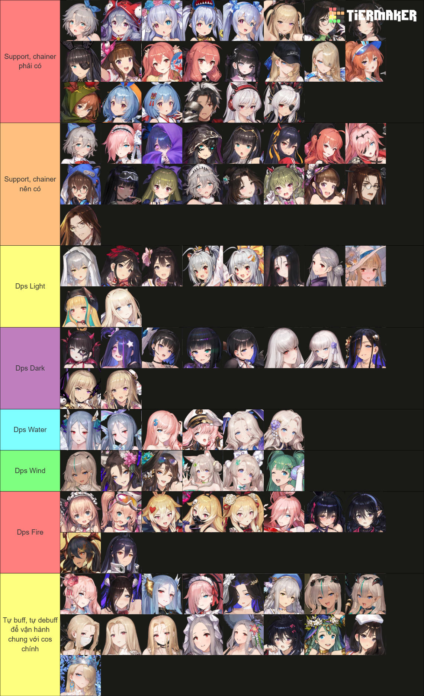

# **GAME GUIDE CƠ BẢN VÀ NHỚ ĐỌC LƯU Ý TRƯỚC FUCK YOU**

**From**: Lốc Xoáy Tinh Hoàn

**Source**: 

- Trust me bruh trong ae discord
- <https://browndust2.miraheze.org/wiki/Character>

------

Guide bố mày viết theo kinh nghiệm cá nhân và suy nghĩ cá nhân nên có thể đúng với người này sai với người khác vì vậy nào lèm bèm vô discord ping **@Anash** solo.

## Mục Lục

- [**GAME GUIDE CƠ BẢN VÀ NHỚ ĐỌC LƯU Ý TRƯỚC FUCK YOU**](#game-guide-cơ-bản-và-nhớ-đọc-lưu-ý-trước-fuck-you)
  - [Mục Lục](#mục-lục)
  - [Mục tiêu của Guide](#mục-tiêu-của-guide)
  - [🚨 Lưu ý quan trọng](#-lưu-ý-quan-trọng)
  - [Ability skill](#ability-skill)
  - [Xây dựng đội hình](#xây-dựng-đội-hình)
  - [Danh sách buffer cơ bản](#danh-sách-buffer-cơ-bản)
  - [Ví dụ team vật lí cơ bản](#ví-dụ-team-vật-lí-cơ-bản)
    - [Team 1](#team-1)
    - [Team 2](#team-2)
    - [Team 3](#team-3)
  - [Tier List cá nhân](#tier-list-cá-nhân)
  - [Awakening](#awakening)
  - [Refine Gear](#refine-gear)
  - [Weapons](#weapons)
  - [Bonding](#bonding)
  - [Event shop](#event-shop)
  - [Golden Thread Shop](#golden-thread-shop)
  - [Guild Shop](#guild-shop)
  - [Powder of Hope Shop](#powder-of-hope-shop)
  - [The Golden Colosseum Shop](#the-golden-colosseum-shop)
  - [Refinement Remnant Shop](#refinement-remnant-shop)
  - [Mirror Wars Shop](#mirror-wars-shop)
  - [Potential of Tear](#potential-of-tear)
  - [Spark of rampage](#spark-of-rampage)

## Mục tiêu của Guide

- Một vài từ lóng anh em hay xài
- Hỗ trợ acc reroll
- Xây dựng [**Đội Hình**](#xây-dựng-đội-hình) cơ bản
- Hướng dẫn chạy map hiệu quả bằng [**Ability skill**](#ability-skill)
- Quản lí và khai thác tài nguyên
- Một số nhân vật xương sống cho vài đội hình
- [**Tier list**](#tier-list-cá-nhân) theo ý kiến Khá Bảnh

## 🚨 Lưu ý quan trọng

- Không sử dụng  [**Tear**](#potential-of-tear) or [**pot**](#potential-of-tear) 1 cách bừa bãi vì nó là tài nguyên có hạn
- Không sử dụng  [**Burst**](#spark-of-rampage) or [**bút**](#spark-of-rampage) 1 cách bừa bãi vì nó là tài nguyên có hạn
- Không  [**Awakening**](#awakening) linh tinh
- Không sử dụng  [**Refining Crystal**](#refine-gear) cho [**Weapons**](#weapons) tier thấp
- Hạn chế sử dụng  [**Refining Powder**](#refine-gear) cho [**Weapons**](#weapons) ở đầu game, vũ khí 18 điểm là sử dụng khá ok rồi

## Ability skill

**Set Up chạy map**

1. **Search**: Dùng để phát hiện tài nguyên ẩn trong map
2. **Absorption**: Dùng để hút toàn bộ tài nguyên trên map
3. **OverPower**: Dùng để tông quái trên map đỡ tốn thời gian đánh
4. **Assemble**: Dùng hút mấy con thỏ xanh trên map kiếm tí vàng
5. **Rush**: Dùng để tăng tốc chạy, nên sử dụng Luven vì nó chạy nhanh nhất

**Lộ trình chạy:** từ map 1 => map cao nhất

**Thứ tự dùng skill:**

**Search** -> **Absorption** -> **OverPower** -> **Assemble** -> **Rush**

Theo nguồn Trust me bro chạy full thì 1 tuần cày được 5-6m vàng.

## Xây dựng đội hình

Một đội hình cơ bản thường gồm **2-3 support/buffer**, còn lại là **DPS**.

Ưu tiên chọn support theo loại team:

- **Team vật lí:** dùng các buffer tăng ATK, Crit Rate, CRD.
- **Team phép:** dùng các buffer tăng MATK, Crit Rate, CRD.
- **Team khắc hệ:** dùng Diana khi DPS có lợi thế hệ với mục tiêu.
- **Team boss:** chọn support theo điều kiện skill, chain, range và loại damage của DPS.

Không có một đội hình cố định dùng cho mọi content. Tùy boss, map, hệ quái và DPS đang có mà thay support cho phù hợp.

## Danh sách buffer cơ bản

| Diana 1 | Diana 2 | Liberta |
| :---: | :---: | :---: |
|  |  |  |
| Tăng damage khắc hệ | Tăng damage khắc hệ | Buff %ATK Hồi SP Crit Rate |

| Lathel | Arines | Rou |
| :---: | :---: | :---: |
|  |  |  |
| Buff %ATK | Buff %ATK Crit Rate | Buff giáp Crit Rate %CRD |

| Terresa | Helena | Granadair |
| :---: | :---: | :---: |
|  |  |  |
| Buff % DMG Deal Điều kiện: đánh <= 5 mục tiêu Mục tiêu <= 5 chain | Buff %matk Buff crit Hồi máu | Buff %matk Hồi sp |

| Granadair 2 | Elpis | Terresa 2 |
| :---: | :---: | :---: |
|  |  |  |
| Buff damage dealt Hấp thụ debuff | Buff %MATK Crit Rate | Buff %ATK Buff %MATK Hồi máu |

## Ví dụ team vật lí cơ bản

Các team dưới đây chỉ là ví dụ bộ **3 buffer**, không bắt buộc cố định.  
Còn lại chọn **2 DPS vật lí tùy ý**, ưu tiên DPS có **range skill to**.

### Team 1

| Rou | Liberta | Granadair|
| :---: | :---: | :---: |
|  |  |  |

### Team 2

| Rou | Liberta | Arines |
| :---: | :---: | :---: |
|  |  |  |

### Team 3

| Arines | Lathel | Terresa 2 |
| :---: | :---: | :---: |
|  |  |  |

> **Core vật lí:** Ưu tiên **Liberta**.  
> Nếu chưa có **Liberta**, có thể dùng **Lathel** từ vé cầu vồng để thay thế tạm.

## Tier List cá nhân

From: Asnassdfaj
## Awakening

> **Awakening** giúp tăng sức mạnh nhân vật/costume nhưng tài nguyên có hạn.
>
> Ưu tiên Awakening cho:
>
> 1. DPS chính sử dụng lâu dài
> 2. Support core dùng nhiều content
> 3. Nhân vật dùng cho boss/event/guild raid
>
> Không nên Awakening linh tinh ở đầu game.

## Refine Gear

> **Refine Gear** dùng để tối ưu chỉ số trang bị.
>
> Lưu ý:
>
> - Đầu game không cần refine quá sâu
> - Không nên dùng tài nguyên refine hiếm cho vũ khí tier thấp
> - Vũ khí khoảng 18 điểm là đủ dùng ổn ở giai đoạn đầu
> - Chỉ refine mạnh khi đã có gear tốt và nhân vật dùng lâu dài

## Weapons

## Bonding

## Event shop

## Golden Thread Shop

## Guild Shop

## Powder of Hope Shop

## The Golden Colosseum Shop

## Refinement Remnant Shop

## Mirror Wars Shop

## Potential of Tear

## Spark of rampage

Dùng để nâng sức mạnh skill của nhân vật hơn nữa, cụ thể check từng cos.

Nguồn: Wiki BD2

| Tên Cửa hàng (Shop) | Số lượng | Thời gian reset |
| :--- | :---: | :--: | 
| **Event shop** | 30x2 | 1 tháng |
| Golden Thread Shop | 55 | 1 tháng | 
| Guild Shop | 50 | 1 tháng |
| Powder of Hope Shop | 55 | 1 tháng |
| The Golden Colosseum Shop | 55 | 1 tháng |
| Refinement Remnant Shop | 200 | 1 tháng |
| Mirror Wars Shop | 55 | 1 tháng |
| Taros Tactical Manual | 30 | 1 tháng |

> **Ghi chú:** Spark/Burst là tài nguyên có hạn, không nên dùng chỉ vì thích nhân vật. Nên ưu tiên costume dùng lâu dài hoặc costume giúp clear boss/event/guild raid.